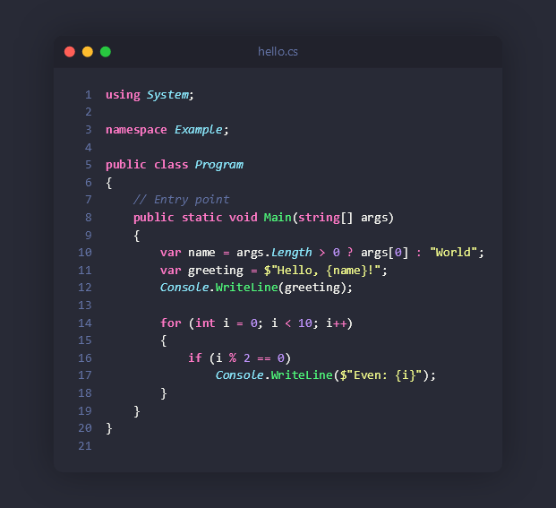

# Germanium

Generate beautiful PNG images of your source code from the terminal.

Inspired by [Carbon](https://github.com/carbon-app/carbon) and [Silicon](https://github.com/Aloxaf/silicon).



## Build

```bash
dotnet build src/Germanium/Germanium.csproj
```

## Usage

```bash
# Generate image with default settings
dotnet run --project src/Germanium -- file.cs

# Set width and height
dotnet run --project src/Germanium -- file.cs --width 800 --height 600

# Choose theme and output path
dotnet run --project src/Germanium -- file.py -o output.png -t monokai

# No decoration
dotnet run --project src/Germanium -- file.rs --no-window --no-line-numbers --no-shadow
```

## Options

| Option | Description |
|---|---|
| `-o, --output` | Output PNG file path |
| `-w, --width` | Image width in pixels |
| `-h, --height` | Image height in pixels |
| `-t, --theme` | Color theme |
| `-l, --language` | Language for syntax highlighting |
| `--font-size` | Font size (default: 14) |
| `--font` | Font family (default: Consolas) |
| `--no-line-numbers` | Hide line numbers |
| `--no-window` | Hide window controls |
| `--title` | Window title |
| `--padding` | Outer padding in pixels (default: 60) |
| `--no-shadow` | Disable shadow |

## Themes

`dracula` (default), `monokai`, `onedark`, `nord`, `solarized-dark`

## Languages

C#, JavaScript/TypeScript, Python, Rust, Go, Java, C/C++ — automatically detected by file extension.

## License

[MIT](LICENSE)
